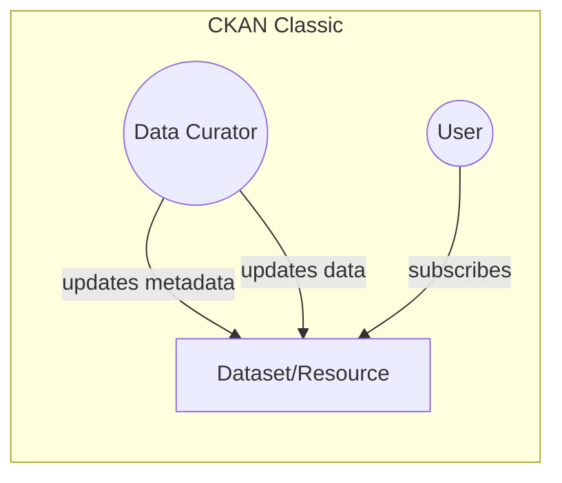
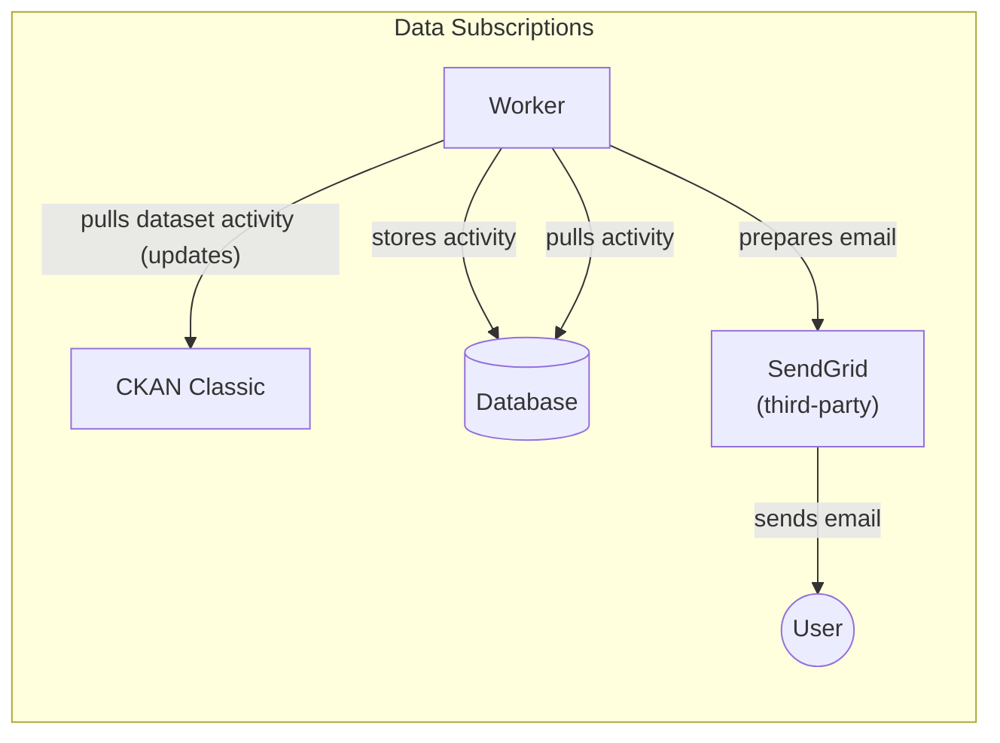

# Data Subscriptions

_Service to monitor and notify users about changes in datasets._

Data Subscriptions is a service meant to notify users when CKAN datasets change. For the end-users, it works like this:



Every 10 minutes, it communicates with CKAN Classic to store the latest updates in a local database. Every 30 minutes, it sends an aggregated notification to users. The worker sends notifications only to users with an active subscription to datasets changed in the past minutes. You can configure all the time frequencies via environment variables.



This service also has a REST API to:

- Change a subscription status.
- Block a dataset from being subscribed.

## API

To list all available routes in the app, you can run the following docker-compose command:

```bash
docker-compose run --rm web data_subscriptions routes
```

Base URI: `/api/v1/`

### Non-subscribable datasets

**Endpoint: `/nonsubscribable_datasets/<string:dataset_id>`**

By default, all datasets are subscribable. It is the data curator's work to disable subscriptions for a dataset.

Available methods:

- `GET` - Check if a dataset is non-subscribable.
- `POST` - Make a dataset non-subscribable, i.e., disable subscriptions.
- `DELETE` - Delete a dataset from list of non-subscribable datasets, i.e., make it subscribable again.

### Subscriptions

**Endpoint: `/subscription/<string:dataset_id>`**

Available methods:

- `GET` - Get if given user is subscribed to given dataset.
  - params: `user_id`
- `POST` - Subscribe a user to a dataset.
  - body: `{"user_id": <string:user_id>}`
- `DELETE` - Unsubscribe s user from a dataset.
  - body: `{"user_id": <string:user_id>}`

### User

**Endpoint: `/user/<string:user_id>`**

Available methods:

- `GET` - Get list of subscriptions for a given user.

## Development

To setup the project using Docker containers:

```sh
$ make setup
```

The project is backed by a test suite, which can be run with a single command:

```sh
$ make test
```

Finally, to start the services and get to see the logs in real time:

```
$ docker-compose up
```

## Deployment

We do continuous deployment [to Heroku](https://gitlab.com/datopian/clients/data-subscriptions/-/blob/master/heroku.yml) via [GitLab CI](https://gitlab.com/datopian/clients/data-subscriptions/-/blob/master/.gitlab-ci.yml).
