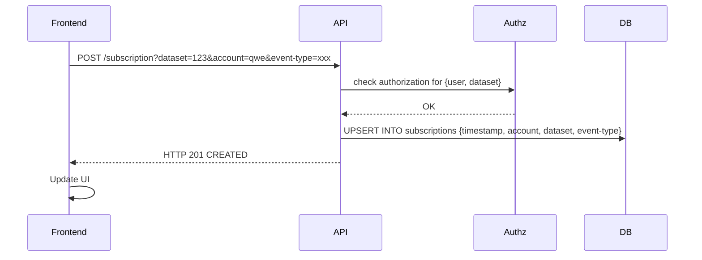
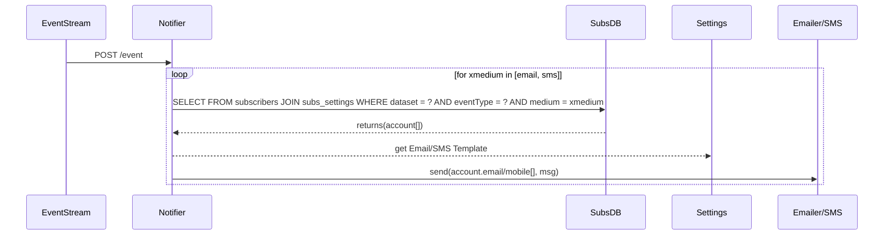
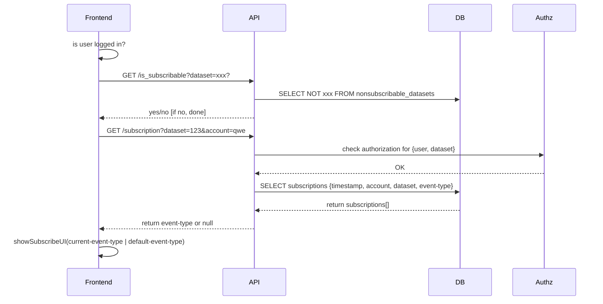
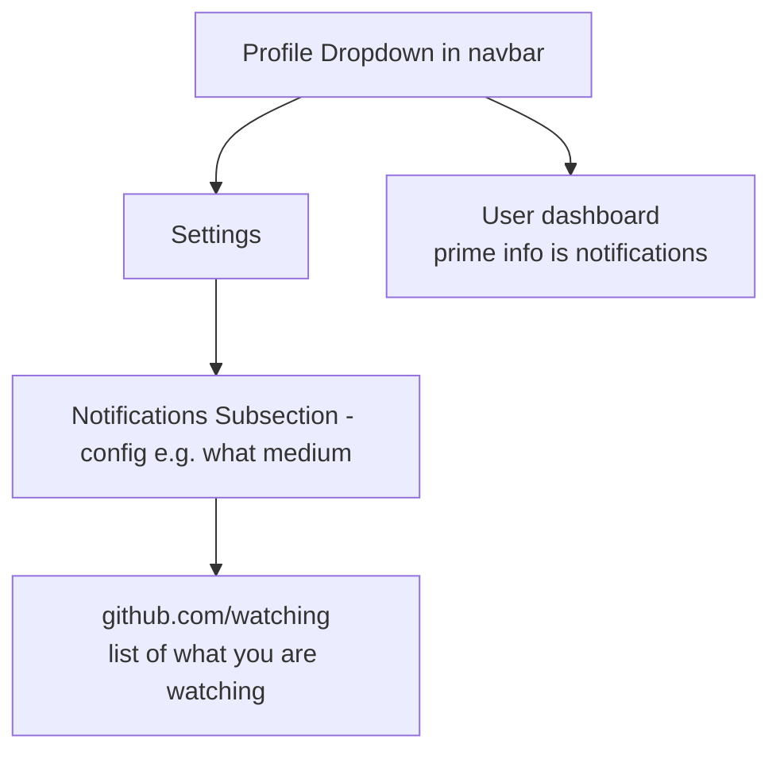

# Subscriptions and Notifications (for Datasets)

Data Subscriptions is a standalone microservice for CKAN that allows users to subscribe to notifications of dataset changes. Notifications are available in several forms: web, email, and  SMS (in development). Users can subscribe and unsubcribe to changes, configure the medium for notifications etc. It is feature complete and actively deployed in production.

The core job story is:

> When I am interested in a given dataset I want to get notifications (in a dashboard, via email etc) when that dataset is updated (or other changes happen) so that I can take action e.g. update my application, check if security issue etc

## Features

* Subscribe to notifications for datasets (+ (maybe) other types of events e.g. someone added or removed organization)
  * From WUI (and email for unwatch)
* Configure medium of notification e.g. email, mobile, web
* View notifications stream arising from my watching
* Review my watched list (and modify it)
* Admin can configure which datasets are watchable
* Admin can view stats about watching

### Flows

* Watch (unwatch) flow
  * From WUI
  * Unwatch from email
  * Optional: initiate watch flow without being registered / logged in yet
* Configure settings flow
* Admin related flows

## How it works

For the end-users, it works like this:

[](https://mermaid-js.github.io/mermaid-live-editor/#/edit/eyJjb2RlIjoiZ3JhcGggTFJcbiAgY3VyYXRvcigoRGF0YSBDdXJhdG9yKSlcbiAgdXNlcigoVXNlcikpXG5cbiAgc3ViZ3JhcGggY2thbltcIkNLQU4gQ2xhc3NpY1wiXVxuICAgIGRhdGFzZXRbXCJEYXRhc2V0L1Jlc291cmNlXCJdXG4gIGVuZFxuXG5cbiAgY3VyYXRvciAtLSB1cGRhdGVzIG1ldGFkYXRhIC0tPiBkYXRhc2V0XG4gIGN1cmF0b3IgLS0gdXBkYXRlcyBkYXRhIC0tPiBkYXRhc2V0XG4gIHVzZXIgLS0gc3Vic2NyaWJlcyAtLT4gZGF0YXNldFxuIiwibWVybWFpZCI6eyJ0aGVtZSI6ImRlZmF1bHQifSwidXBkYXRlRWRpdG9yIjpmYWxzZX0)

Every 10 minutes, it communicates with CKAN Classic to store the latest updates in a local database. Every 30 minutes, it sends an aggregated notification to users. The worker sends notifications only to users with an active subscription to datasets changed in the past minutes. You can configure all the time frequencies via environment variables.

[](https://mermaid-js.github.io/mermaid-live-editor/#/edit/eyJjb2RlIjoiZ3JhcGggTFJcbiAgc3ViZ3JhcGggZGF0YXN1YnNjcmlwdGlvbnNbXCJEYXRhIFN1YnNjcmlwdGlvbnNcIl1cbiAgICBEYXRhYmFzZVxuICAgIFdvcmtlclxuICBlbmRcblxuICBzdWJncmFwaCBja2FuY2xhc3NpY1tcIkNLQU4gQ2xhc3NpY1wiXVxuICAgIGNrYW5hcGlbXCJBUElcIl1cbiAgZW5kXG5cbiAgV29ya2VyIC0tIFwicHVsbHMgZGF0YXNldCBhY3Rpdml0eSAodXBkYXRlcylcIiAtLT4gY2thbmFwaVxuICBXb3JrZXIgLS0gc3RvcmVzIGFjdGl2aXR5IC0tPiBEYXRhYmFzZVxuICBXb3JrZXIgLS0gcHJlcGFyZXMgZW1haWwgLS0-IHNlbmRncmlkW1wiU2VuZEdyaWQ8YnI-KHRoaXJkLXBhcnR5KVwiXVxuICBXb3JrZXIgLS0gcHVsbHMgYWN0aXZpdHkgLS0-IERhdGFiYXNlXG4gIHNlbmRncmlkIC0tIHNlbmRzIGVtYWlsIC0tPiB1c2VyKChcIlVzZXJcIikpIiwibWVybWFpZCI6eyJ0aGVtZSI6ImRlZmF1bHQifSwidXBkYXRlRWRpdG9yIjpmYWxzZX0)

This service also has a REST API to:

- Change a subscription status.
- Block a dataset from being subscribed.

## API

To list all available routes in the app, you can run the following docker-compose command:

```bash
docker-compose run --rm web data_subscriptions routes
```

Base URI: `/api/v1/`

### Non-subscribable datasets

**Endpoint: `/nonsubscribable_datasets/<string:dataset_id>`**

By default, all datasets are subscribable. It is the data curator's work to disable subscriptions for a dataset.

Available methods:

- `GET` - Check if a dataset is non-subscribable.
- `POST` - Make a dataset non-subscribable, i.e., disable subscriptions.
- `DELETE` - Delete a dataset from list of non-subscribable datasets, i.e., make it subscribable again.

### Subscription Status

**Endpoint: `/subscription_status`**

Available methods:

- `POST` - Check the a user's subscription status.
  - body: `{"dataset_id": <string:dataset_id>, "kind": "DATASET", "user_id": <string:user_id>}` //for a single dataset subscription
  - body: `{"kind": "NEW_DATASETS", "user_id": <string:user_id>}` //for a new dataset subscription

### Subscriptions

**Endpoint: `/subscription`**

Available methods:

- `POST` - Subscribe a user to notifications.
  - body: `{"dataset_id": <string:dataset_id>, "kind": "DATASET", "user_id": <string:user_id>, "username": <string:username>, "email": <string:email> }` //for a single dataset subscription
  - body: `{"kind": "NEW_DATASETS", "user_id": <string:user_id>, "username": <string:username>, "email": <string:email>}` //for a new dataset subscription
- `DELETE` - Unsubscribe a user from notifications.
  - body: `{"dataset_id": <string:dataset_id>, "kind": "DATASET", "user_id": <string:user_id>}` //for a single dataset subscription
  - body: `{"kind": "NEW_DATASETS", "user_id": <string:user_id>}`  //for a new dataset subscription

### User

**Endpoint: `/user/<string:user_id>`**

Available methods:

- `GET` - Get list of subscriptions for a given authorized user.

### Dataset

**Endpoint: `/dataset/<string:dataset_id>`

Available methods:

- `DELETE` - Delete the subscriptions for given dataset.

### Subscription Report

**Endpoint: `/stat`**

Available methods:

- `GET` - Get report of all subscribers in JSON.
- `GET` - Get report of all subscribers in CSV.
  - param: `download=yes`

## Development

To setup the project using Docker containers:

```sh
$ make setup
```

The project is backed by a test suite, which can be run with a single command:

```sh
$ make test
```

Finally, to start the services and get to see the logs in real time:

```
$ docker-compose up
```

## Deployment

We do continuous deployment [to Heroku](https://gitlab.com/datopian/clients/data-subscriptions/-/blob/master/heroku.yml) via [GitLab CI](https://gitlab.com/datopian/clients/data-subscriptions/-/blob/master/.gitlab-ci.yml).


# Design

## Job Stories

### Dataset Update Notifications via Email or SMS

When using the data in this data portal I want to be  notified (e.g. via email) when one of the key datasetsis updated  so that I know to integrate that updated data with my workflow
 
* [=> by the below: have a user account => signup, login etc
* I want to be able to see a list of all the subscribable datasets
* I want to be choose the datasets i subscribe to (and unsubscribe from)
  * Some datasets may not be subscribable to?? (see admin item)
  * a visual element to “subscribe to this dataset“. This visual element will describe what it means to subscribe, and, provide an action for the user to subscribe herself.
  * Only show subscribe option to logged in users (??)
  * When a registered user visits a dataset page, she sees the option to subscribe to updates for this dataset
  * Bulk unsubscribe
* I want to be able to choose the medium of notification e.g. email or sms (webhook??)
* What events trigger a notification? Any update event to the data (and metadata)
  * TODO: clarify if metadata included
* Frequency control?? E.g. once a day or every event? ANS: every event
* What is the payload? E.g. just email or attachments e.g. CSV
* Can unsubscribe via link in email or via UI
* Confirm their email or text subscription via email b4 being subscribed (GDPR?)
 
### Control what datasets are subscribable to

As a sysadmin user, I want to be able to select (and deselect), from all the datasets on the portal, datasets that can be subscribed to, so that I can use this dataset level flag to build out email and text (sms) subscription services.
 
### View Stats on Subscriptions

When an Admin of a data portal I want to view stats on subscriptions so that I can manage this and report to other stakeholders

* Filter by datasets
* View data on specific users
* Time they subscribed, username, and email
 
### Create/Edit Email Template for Notifications 

When configuring the subscription system I want to be able to create and modify email template so that I can brand and customize the email user's receive

* Is this per dataset? No: it’s generic for all datasets

## Domain Model

* **Subscription**: `tuple(account, dataset, {event-type-filter}, [frequency?], ...)`
  * `tuple(account, filter-function-on-activity-stream)`
* **Subscription Settings**: `tuple(account, media[web|email|sms|newsletter], other options)`
* **Account (User)**: a user for a subscription
  
Alternatively could seem them as any filter operation on an overall activity stream  => leads us into event bus type territory … 

In the most general sense, A "subscription" (for notifications) is a function f:

```
f(event stream) = user's event stream
```

And notifications are:

```
g(user's event stream, settings) => emails/sms etc
```

## Components

* SubscriptionDB + API
* NotifierService e.g. bulk email/sms
* UI
* Notification
* RulesDB (?) (for generating notifications)
 
Required but probably external

* Accounts (user identifier + email + sms)

Notes

* I (account) subscribe to dataset (dataset) X
* Curator updates dset (dataset) X
* I get a notification (event)
* Curator updates dataset (dataset) Y
* I don't get a notification (event)
* Curator updates dataset (dataset) X
* I get a notification (event)

## Sequence Diagrams

### Subscribe (/ Unsubscribe / Change subscription) button click

* TODO: add to sequence checking restrictions on which datasets you can subscribe to



### Event happens ...

* curator edits a datasets and event stream has a new event (EventStream = activity stream table in CKAN Classic))
* MetaStore->>EventStream: `INSERT INTO (dataset, eventType, message)`
* Prior to event happening SubsNotificationService has subscribed itself to the EventStream



* https://github.com/ckan/ckan/blob/master/ckan/model/activity.py
  * There is a big table of all the activities ...
  * Could turn this into an event hub service (esp if we )
    * Could we use postgres listen/notify ...
    * Or we could even just do polling if time internal is not too short ...

### Render subscribe UI in frontend ...

* Frontend needs to check before rendering if this is a dataset that allows subscriptions
* Frontend needs to check if user is subscribed
* TODO.QU: where do we save whether a dataset is subscribable
  * ANS: in a separate table: `nonsubscribable_datasets`



### User views (and changes) notification settings

### User views all existing (and potential?) subscriptions (and changes)

* TODO.QU: does include potential - that's weird in my view (how does it work with 200 datasets or 200k). Just let people subscribe via the dataset page

### Admin views stats ...

### Admin sets subscribable status


## Appendix: How GitHub does it

NB: github has got a lot more complex over the years so user flow isn't quite as smooth as it once was.



### Watch / Unwatch Repo


### Notifications


### Settings


